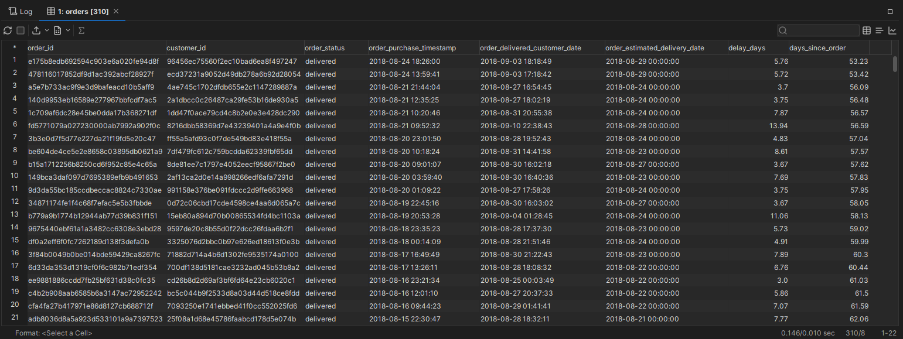
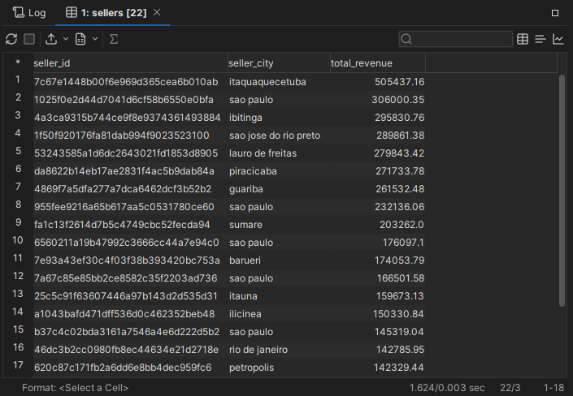
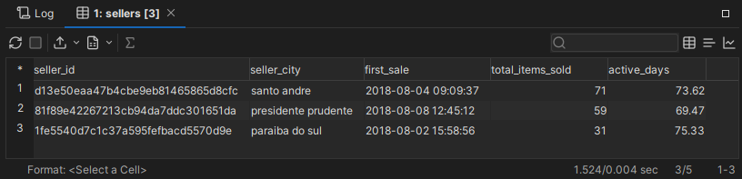
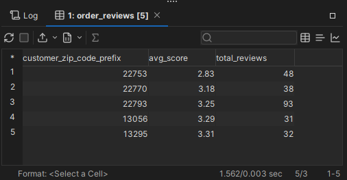

# Requêtes SQL pour le dashboard (Customer Experience)

## A propos du jeu de données 


- [Présentation du jeu de données sur Kaggle](https://www.kaggle.com/datasets/olistbr/brazilian-ecommerce)

## Outil utilisé 

- [DbVizualizer](https://www.dbvis.com/) 

## Liste des tables 

- customers
- geoloc
- order_items
- order_pymts
- order_reviews 
- orders
- products
- sellers
- translation

## Requêtes

*Note* : Nous considérons que la date d'aujourd'hui est le **17 octobre 2018** (`'2018-10-17'`).

### Question 1

> En excluant les commandes annulées, quelles sont les commandes récentes de moins de 3 mois que les clients ont reçues avec au moins 3 jours de retard ?

```sql
WITH recent_orders AS (
  SELECT
    o.order_id,
    o.customer_id,
    o.order_status,
    o.order_status,
    o.order_purchase_timestamp,
    o.order_delivered_customer_date,
    o.order_estimated_delivery_date,
    ROUND(julianday(date('2018-10-17')) - julianday(o.order_purchase_timestamp), 2) AS days_since_order, 
    ROUND(julianday(o.order_delivered_customer_date) - julianday(o.order_estimated_delivery_date), 2) AS delay_days
  FROM orders o
  WHERE o.order_delivered_customer_date IS NOT NULL -- Exclure les commandes non livrées
  AND o.order_status != 'canceled' -- Exclure les commandes annulées
),
delayed_orders AS (
  SELECT *
  FROM recent_orders
  WHERE delay_days >= 3 -- Retard d'au moins 3 jours
  AND days_since_order <= 90 -- Commandes de mois de 3 mois (90 jours)
)
SELECT
  do.order_id,
  do.customer_id,
  do.order_status,
  do.order_purchase_timestamp,
  do.order_delivered_customer_date,
  do.order_estimated_delivery_date,
  do.delay_days,
  do.days_since_order
FROM delayed_orders do
ORDER BY do.order_purchase_timestamp DESC;
```

**Résultat** : 310 commandes.



### Question 2

> Qui sont les vendeurs ayant généré un chiffre d'affaires de plus de 100 000 Real sur des commandes livrées via Olist ?

```sql
SELECT 
  s.seller_id,
  s.seller_city,
  SUM(op.payment_value) as total_revenue
FROM sellers AS s
JOIN order_items AS oi
  ON oi.seller_id = s.seller_id
JOIN orders AS o
  ON o.order_id = oi.order_id
JOIN order_pymts AS op
  ON op.order_id = o.order_id
WHERE o.order_status = 'delivered'
GROUP BY s.seller_id, s.seller_city
HAVING SUM(op.payment_value) > 100000
ORDER BY total_revenue DESC;
```

**Résultat** : 22 vendeurs ont réalisés plus de 100K de chiffre d'affaire avec Olist.



### Question 3

> Qui sont les nouveaux vendeurs (moins de 3 mois d'ancienneté) qui sont déjà très engagés avec la plateforme (ayant déjà vendu plus de 30 produits) ?

```sql
WITH seller_stats AS (
  SELECT 
    s.seller_id,
    s.seller_city,
    MIN(o.order_purchase_timestamp) as first_sale,
    SUM(oi.order_item_id) as total_items_sold -- order_item_id : nombre d'articles dans une commande
  FROM sellers AS s
  JOIN order_items AS oi ON s.seller_id = oi.seller_id
  JOIN orders AS o ON oi.order_id = o.order_id
  GROUP BY s.seller_id, s.seller_city
),
recent_sellers AS (
SELECT 
  seller_id,
  seller_city,
  first_sale,
  total_items_sold,
  ROUND(julianday(date('2018-10-17')) - julianday(first_sale), 2) as active_days
FROM seller_stats
)
SELECT *
FROM recent_sellers AS rs
WHERE 
  rs.active_days <= 90  -- moins de 3 mois d'ancienneté
  AND rs.total_items_sold > 30  -- plus de 30 produits vendus
ORDER BY rs.total_items_sold DESC;
```

**Résultat**



### Question 4

> Quels sont les 5 codes postaux, enregistrant plus de 30 reviews, avec le pire review score moyen sur les 12 derniers mois ?

```sql
SELECT
  c.customer_zip_code_prefix,
  ROUND(AVG(orvws.review_score), 2) AS avg_score,
  COUNT(DISTINCT orvws.review_id) AS total_reviews
FROM order_reviews AS orvws
JOIN orders AS o 
  ON orvws.order_id = o.order_id
JOIN customers AS c
  ON c.customer_id = o.customer_id
WHERE julianday(date('2018-10-17')) - julianday(orvws.review_creation_date) <= 365 
GROUP BY c.customer_zip_code_prefix
HAVING COUNT(DISTINCT orvws.review_id) > 30 
ORDER BY avg_score ASC
LIMIT 5;
```

**Résultat**

